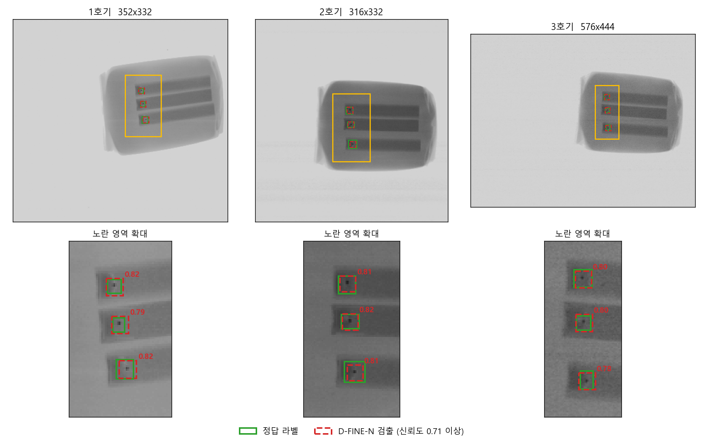
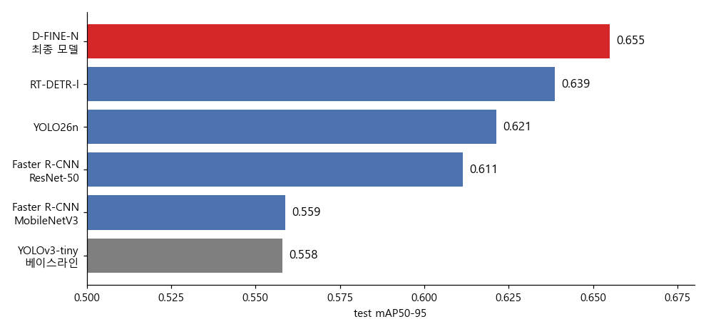
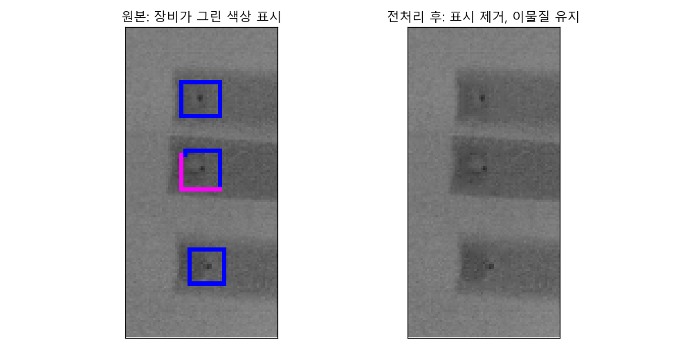

# X-ray 영상 기반 완제품 이물질 탐지

제6회 K-인공지능 제조데이터 분석 경진대회 일반국민 및 대학생 부문 **팀 엽총창** 소스코드




## 개요

- KAMP X-ray 검사장비 AI 데이터셋의 완제품 X선 영상 2,532장에서 이물질 4,494개를 검출하는 모델을 개발함
- 이물질은 상자 한 변이 5px에서 21px 사이이고 대부분 10px 내외인 매우 작은 검은 점 형태임
- 최종 모델은 **D-FINE-N**으로, 파라미터 3.7M의 경량 DETR 계열 검출기이며 CPU 4스레드에서 초당 10.3장을 처리함
- 베이스라인 YOLOv3-tiny를 포함한 6개 모델을 동일한 데이터 분할과 채점 코드로 비교함
- 데이터 검사, 전처리 검증, 학습, 추론, 채점, 속도 측정이 스크립트 하나로 자동 실행됨

## 성능

평가 데이터 396장, 정답 상자 663개 기준

| 모델 | 파라미터 | mAP50 | mAP50-95 | Precision | Recall | F1 | FPS |
|---|---|---|---|---|---|---|---|
| YOLOv3-tiny, 베이스라인 | 8.7M | 0.981 | 0.558 | 0.989 | 0.989 | 0.989 | 13.5 |
| Faster R-CNN, ResNet-50 FPN | 41.8M | 0.988 | 0.611 | 0.989 | 0.989 | 0.989 | - |
| Faster R-CNN, MobileNetV3 FPN | 19.4M | 0.985 | 0.559 | 0.986 | 0.986 | 0.986 | - |
| YOLO26n | 2.5M | 0.987 | 0.621 | 0.991 | 0.991 | 0.991 | - |
| RT-DETR-l | 32.8M | 0.987 | 0.639 | 0.988 | 0.988 | 0.988 | 2.8 |
| **D-FINE-N, 최종 모델** | **3.7M** | **0.989** | **0.655** | 0.988 | 0.989 | 0.989 | 10.3 |

- 신뢰도 임계값은 모델별로 검증 데이터에서 F1이 최대가 되는 값으로 정하고, 평가 데이터는 해당 값으로 1회만 채점함
- 입력 크기는 모든 모델 640이며, FPS는 CPU 4스레드, 배치 크기 1에서 전처리, 추론, 후처리를 포함해 측정함
- D-FINE-N은 결함 영상 369장을 모두 불량으로, 이물질이 없는 영상 27장을 모두 정상으로 판정함



## 데이터

| 구분 | train | val | test | 합계 |
|---|---|---|---|---|
| 영상 | 1,767 | 369 | 396 | 2,532 |
| 이물질 상자 | 3,225 | 606 | 663 | 4,494 |

- 영상은 회색조 PNG, 라벨은 YOLO 텍스트 형식이며 data 폴더에 모두 포함됨
- 공식 라벨 500장과 팀원 3명이 직접 작성한 팀 라벨 2,032장으로 구성됨
- 60초 이내 연속 촬영된 영상을 하나의 묶음으로 보고 묶음 단위로 분할하여, 유사한 영상이 학습과 평가에 나뉘어 들어가지 않도록 함
- 분할은 고정되어 있으며, 모든 스크립트는 실행 시 영상 목록 파일의 해시값으로 데이터 버전을 확인함

### 전처리



- 원본 영상에는 검사 장비가 이물질 위에 그린 색상 상자가 있어, 그대로 학습하면 모델이 이물질 대신 색상 표시를 학습할 우려가 있음
- 색상 픽셀만 주변 회색 픽셀의 5x5 평균값으로 메우고 이물질은 그대로 유지함
- 원본 BMP에 동일한 전처리를 다시 적용하면 data 폴더의 2,532장과 픽셀 단위로 일치함

```bash
python scripts/verify_preprocess.py --raw "<원본 데이터셋 폴더>/dataset/test1/yolov3"
```

## 설치

Windows 11, Python 3.10, NVIDIA RTX 4050 Laptop GPU 환경에서 검증함

```bash
conda create -n kamp python=3.10 -y
conda activate kamp
pip install torch==2.6.0 torchvision==0.21.0 --index-url https://download.pytorch.org/whl/cu124
pip install -r requirements.txt
```

## 빠른 실행

제출 가중치로 데이터 검사, 추론, 채점, 속도 측정, 모델 비교까지 한 번에 실행함. GPU 기준 약 5분 소요됨

```bash
.\run_all.ps1        # Windows
bash run_all.sh      # Linux, macOS
```

- 결과는 outputs 폴더에 생성되며, 마지막 단계에서 제출 결과와 점수가 같은지 비교하여 출력함
- 학습부터 다시 하려면 .\run_all.ps1 -Train 으로 실행하며, RTX 4050 Laptop 기준 약 3시간 소요됨

## 학습

```bash
python scripts/download_pretrained.py      # COCO 사전학습 가중치
python scripts/train.py                    # D-FINE-N
python scripts/train.py --model yolov3_tiny
```

| 항목 | D-FINE-N | YOLOv3-tiny |
|---|---|---|
| 시작 가중치 | COCO 사전학습 | COCO 사전학습 |
| 입력 크기 | 640 | 640 |
| 에폭 | 최대 50, 43에서 조기 종료 | 100 |
| 배치 크기 | 16 | 16 |
| 학습 시간 | 약 98분 | 약 59분 |

- 약 10px 이물질이 더 작아지지 않도록 mosaic와 큰 비율의 축소 증강은 사용하지 않음
- 회색조 영상이므로 색상 증강은 사용하지 않고, 밝기 변화, 상하좌우 반전, 이동, 소폭 확대 축소만 적용함
- 체크포인트는 검증 데이터 성능으로 선택하며, 평가 데이터는 학습과 모델 선택에 사용하지 않음
- 설정값은 configs 폴더에 있음

## 추론 및 평가

```bash
python scripts/predict.py                  # val, test 추론
python scripts/evaluate.py                 # val에서 임계값 결정 후 test 채점
python scripts/predict.py --model yolov3_tiny
python scripts/evaluate.py --model yolov3_tiny
```

- 최종 모델의 평가 데이터 예측 결과는 results/dfine_n/test_predictions.csv에 저장됨
- 영상별 판정 결과는 results/dfine_n/test_image_decisions.csv, 전체 채점 결과는 results/dfine_n/eval_report_test.json에 저장됨

## 폴더 구조

```
├── configs/          학습 설정
├── data/             학습용 데이터, 영상과 라벨, 분할 정보
├── docs/             평가 지표 정의, 보고서 표와 결과 파일 대응표, README 그림
├── experiments/      비교 모델 4종과 오류 분석 실험 코드
├── preprocessing/    원본 영상에서 학습용 데이터를 만든 전처리, 라벨링, 분할 코드
├── results/          제출 결과, 평가 리포트, 예측 결과, 학습 기록
├── scripts/          데이터 검사, 학습, 추론, 채점, 속도 측정 스크립트
├── src/kamp_xray/    데이터 로딩, 채점, 모델별 학습과 추론 코드
├── third_party/      베이스라인 YOLOv3 모델 코드
├── weights/          제출 가중치
├── requirements.txt
├── run_all.ps1
└── run_all.sh
```

## 출처

- 데이터: KAMP 한국인공지능제조플랫폼 X-ray 검사장비 AI 데이터셋
- D-FINE-N: Hugging Face transformers 구현, ustc-community/dfine-nano-coco 사전학습 가중치, Apache-2.0
- YOLOv3-tiny: ultralytics/yolov3 2020년 버전을 PyTorch 2.6 환경에 맞게 수정하여 사용, GPL-3.0
