# 제6회 K-인공지능 제조데이터 분석 경진대회 보고서 (초안 v0)

> **초안 상태 (2026-10-07)**. 숫자는 `docs/experiments.md`, `docs/analysis.md`와 `runs/minyeop/` 결과 파일에서 가져왔다. 그림은 `ppt/make_figures.py`로 만든다(`ppt/figures/`).
> 대회 양식(`docs/보고서양식_미리보기.html`)의 장 구조를 따른다. 서식은 ◦(휴먼명조 14) / -(14) / *(10, 주석)이다. 최종본은 **대회 제공 원본 양식**에 옮겨 PDF로 만든다.
> `[작성 필요]` = 아직 없는 내용, `[확정 필요]` = 팀 결정이 필요한 것, `[확인 필요]` = 사실 확인이 필요한 것.

## 빈 곳 체크리스트 (마감 전에 채울 것)
| 항목 | 장 | 상태 |
|---|---|---|
| 프로젝트명, 팀명, 팀원 서명, 날짜 | 표지 | [확정 필요] |
| 데이터가 나타내는 공정 상태 설명(금속구·테스트피스의 의미) | 1 | [확인 필요] 데이터 설명서 문구만 있음 |
| 전처리 코드, 표시 제거 방법 설명 | 1, 6 | [작성 필요] 코드가 저장소에 없음 |
| 표시 제거 **흔적** 검증 | 1 | [미실시] |
| 최종 모델 D-FINE-N 확정 확인(미탐지 우선이라는 사후 우선순위에 팀 동의), 강건성 시험의 val 반복 | 2 | [확정 필요] 선정은 제가 했고 팀 합의 전 |
| 계획서와 비교 모델 일치 여부 | 2 | [확인 필요] 작성 요령이 "계획서에 따라"를 언급 |
| 팀원 모델 3개의 학습 설정(epoch, batch, 증강, 파라미터, 학습 시간) | 2 | [확인 필요] 가중치로 다시 평가만 했고 D-FINE-N은 기록을 받지 못함 |
| 재검사 기준의 현장 비용 가정 | 4 | [확정 필요] |
| 한 번에 실행하는 스크립트, 테스트 예측 결과 CSV | 6 | [작성 필요] |
| 합성 평가 데이터 기준본을 팀원 PC에서 `--verify`로 확인 | 6 | [확인 필요] numpy·opencv 버전에 약하게 의존 |
| 설문 완료 화면 캡처 | 끝 | [작성 필요] |

---

## 표지
- **프로젝트명(안)**: 점수가 포화된 X-ray 이물 검출에서 점수 뒤의 진짜 성능을 검증하다 — 평가 재설계와 강건성 시험 [확정 필요]
- **팀명**: [확정 필요]
- **내용요약(안)**:
  ◦ X-ray 영상에서 약 10px의 금속구 결함을 찾는 문제에서 6개 모델(YOLOv3-tiny 베이스라인, Faster R-CNN ResNet-50·MobileNetV3, 팀원의 YOLO26n·RT-DETR-l·D-FINE-N)을 같은 평가 코드로 비교했다.
  ◦ 기본 지표(IoU 0.5 기준 F1)는 여섯 모델 모두 0.986~0.991로 구분되지 않았고, 정답 박스 크기가 고정된 라벨이 점수를 부풀렸다.
  ◦ 그래서 공식·팀 라벨 분리, 중심 거리 평가, mAP50-95, 그리고 결함을 지우거나 합성하는 강건성 시험으로 모델을 다시 평가했다.
  ◦ 결과: 놓침으로 보이던 오류는 박스 크기 차이였고, 실제 약점은 옅은 결함(대비 약 13 미만), 노이즈 무늬 오경보(R50·YOLO26n만 강건), MobileNet의 위치 의존이었다. 최종 모델은 val 성능이 동률 선두이고 미탐지 강건성이 가장 좋으며 작은 D-FINE-N으로 선정했다(약점은 노이즈 보간 오경보, 오경보 우선 현장에는 R50·YOLO26n을 제안) [팀 확정 필요].

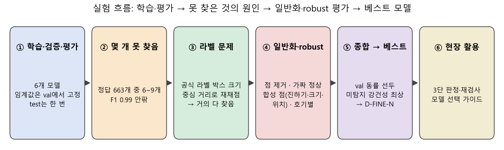

---

## 제1장. 데이터 이해 및 진단〔15점〕

◦ **데이터가 나타내는 공정 상태** [확인 필요]
- X-ray 이물 검출기가 촬영한 완제품 영상이고, 모든 이미지가 장비의 NG 판정 이미지다. 빈 라벨 105장은 제품이 반만 찍혀 시험편이 보이지 않는 사진이다.
- 영상에는 어두운 직사각형 막대와 그 끝의 작은 점이 보이고, 데이터 설명서는 이 점을 `defect`(금속구)로, 막대를 테스트피스로 부른다.
- 분석 목적은 이 결함(약 10px 박스, 점 자체는 약 3px)을 찾는 검출 모델과, 모델이 놓치는 조건을 밝히는 것이다.
* 금속구·테스트피스가 공정에서 어떤 의미인지는 데이터 설명서 문구에서 가져왔고 공정 문서로 확인하지 않았다.

◦ **데이터 구성**
- 원본 BMP 2,809장에서 같은 호기 내 중복 277장을 제거해 고유 이미지 2,532장, 박스 4,494개
- 호기 3종(1호기 943, 2호기 805, 3호기 784장), 해상도 4종(316x332, 352x332, 412x332, 576x444), 촬영 6~9월
- 분할: train 1,767 / val 369 / test 396장. 연속 촬영(60초 이내) 묶음 단위 무작위(seed 42)라 비슷한 사진이 양쪽으로 갈라지지 않는다.

◦ **주요 변수**
- `manifest.csv`: 분할, 라벨 출처(공식/팀), 호기, 가로·세로, 촬영 시각, 촬영 묶음
- `conditions.csv`(박스별): 박스 크기, 국소 대비, 배경 밝기, 가장자리 거리, 호기, 해상도, 월, 출처와 각 구간
- 파일명 접두 001/002는 호기가 **아니다**(호기는 `manifest.csv`의 `machine`). 해상도도 호기에 고정되지 않는다(1호기에 3종).

◦ **전처리 내역** [작성 필요]
- 중복 제거 → 장비가 그린 색 사각형 표시 제거(주변 회색으로 메움) → 회색조 PNG
* 전처리 코드는 현재 저장소에 없다. 팀원에게 코드와 정확한 방법을 받아 여기에 쓴다.

◦ **진단 ① 색 표시 지름길**
- 장비가 결함 자리마다 색 사각형을 그리므로 지우지 않고 학습하면 모델이 결함이 아니라 표시를 본다. 이전 시도(이전 데이터 기준)에서 표시가 있는 이미지로 학습한 모델은 표시를 지운 입력에서 정답을 하나도 찾지 못했다.
- 그래서 표시를 지운 데이터로만 학습·평가했다. **지운 흔적이 남아 단서가 되는지는 아직 검증하지 못했다** [미실시].

◦ **진단 ② 라벨이 두 종류다 — 점수를 부풀리는 원인**
- 공식 라벨 500장(박스 1,147개)은 사람이 그려 한 변이 5~21px로 제각각이고, 팀 라벨 2,032장(박스 3,347개)은 클릭 중심에 **같은 크기의 네모를 자동 생성**해 항상 10px 또는 약 13px이다.
- 모델이 고정 크기만 내도 팀 라벨에는 IoU가 잘 맞는다. 그래서 **모든 결과를 전체 / 공식 라벨만으로 나눠** 보고한다.

◦ **진단 ③ 정상 이미지가 없다, 해상도별 라벨 구성이 다르다**
- 모든 이미지가 NG 판정이라 오경보를 잴 정상 이미지가 사실상 없다 → 3장에서 점을 지운 "가짜 정상"을 쓴다.
- 해상도별 공식 라벨 박스 비율이 10%~76%로 달라 호기·해상도를 비교할 때 라벨 구성이 섞인다(3장).

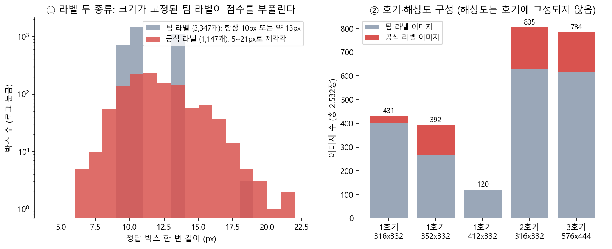
*왼쪽: 정답 박스 한 변의 분포(로그 눈금). 팀 라벨은 10px와 약 13px에 몰려 있고 공식 라벨은 퍼져 있다. 오른쪽: 호기·해상도별 이미지 수와 공식 라벨 비율.*

---

## 제2장. AI 예측모델 개발 및 성능평가〔40점〕

◦ **비교 모델** [계획서와 일치하는지 확인 필요]
| 모델 | 역할 | 입력 | 학습 | 파라미터 | 학습 시간 |
|---|---|---|---|---|---|
| YOLOv3-tiny | **베이스라인**(제공 YOLOv3 코드, 호환 수정본) | 640 | COCO 사전학습, 100 epoch, batch 16, 모자이크·색상·반전 증강 | 8.7M | 59분 |
| Faster R-CNN ResNet-50 FPN | 비교 1 | 640 | COCO 사전학습, 20 epoch, batch 4, 좌우 반전, AMP | 41.4M | 67분 |
| Faster R-CNN MobileNetV3 FPN | 비교 2(경량) | 640 | COCO 사전학습, 20 epoch, batch 4, 앵커 16~256 | 19.0M | 20분 |
| YOLO26n | 비교 3(팀원) | 1024 | COCO 사전학습, 40 epoch, batch 8, 기본 증강 | [확인 필요] | [확인 필요] |
| RT-DETR-l | 비교 4(팀원) | 640 | COCO 사전학습, 최대 30 epoch(계획), batch 4 | [확인 필요] | [확인 필요] |
| D-FINE-N | 비교 5(팀원) | 640 | Hugging Face 구현, 학습 설정 기록 없음 | [확인 필요] | [확인 필요] |
* 팀원 모델 3개는 `weights/pts/`의 가중치를 우리와 **같은 코드로 다시 평가**했다(임계값도 val에서 다시 정함). 팀원이 자기 폴더에 기록한 값과 다를 수 있다. 입력 크기와 후처리(신뢰도 하한, 최대 검출 수)는 각 팀원의 설정을 따랐다.

◦ **동일 평가 조건**
- 같은 데이터·분할, 신뢰도 임계값은 모델별로 **val에서 F1이 최대인 값으로 정해 고정**(R50 0.95, YOLOv3-tiny 0.06, MobileNet 0.93, YOLO26n 0.42, RT-DETR-l 0.74, D-FINE-N 0.66), test는 한 번만 평가
- 박스 매칭: 신뢰도가 높은 검출부터 정답 하나에 검출 하나(IoU 0.5). 모든 모델이 같은 평가 코드(`report.py`)로 채점된다.
- 학습 코드가 내는 자체 지표(신뢰도 0.1 한 지점 값)는 쓰지 않았다.

◦ **결과 — 기본 지표는 여섯 모델이 같고, 더 엄격한 지표에서 갈린다 (test)**
| 모델 | F1 (IoU 0.5) | 공식 라벨만 F1 | mAP50 | **mAP50-95** | 공식 라벨만 mAP50-95 |
|---|---|---|---|---|---|
| Faster R-CNN R50 | 0.989 | 0.964 | 0.988 | **0.611** | **0.362** |
| YOLOv3-tiny | 0.989 | 0.964 | 0.981 | 0.558 | 0.344 |
| Faster R-CNN MobileNetV3 | 0.986 | 0.959 | 0.985 | 0.559 | 0.335 |
| YOLO26n | 0.991 | 0.969 | 0.990 | 0.633 | 0.358 |
| RT-DETR-l | 0.988 | 0.961 | 0.987 | 0.639 | 0.360 |
| D-FINE-N | 0.989 | 0.964 | 0.989 | **0.659** | **0.365** |

- 여섯 모델의 F1은 0.986~0.991이고 중심 5px 기준 F1은 0.998~1.000이다. mAP50-95는 D-FINE 0.659 > RT-DETR 0.639 > YOLO26n 0.633 > R50 0.611 > MobileNet 0.559 ≈ YOLOv3-tiny 0.558로 갈리지만, **공식 라벨만 보면 0.335~0.365로 좁아진다.** 박스를 정답에 맞추는 정밀도 차이이지 찾는 능력의 차이가 아니다.

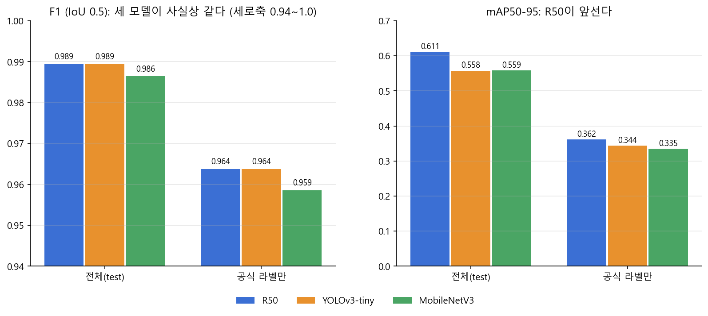
*그림은 우리 3개 모델만 그렸다(6개 모델 값은 위 표). F1(IoU 0.5)은 사실상 같고(세로축이 0.94부터이니 눈금을 주의), mAP50-95에서 차이가 난다. 공식 라벨만 보면 F1은 0.96대로 내려간다.*

◦ **지표 재설계 — 중심 거리 평가(평가 v2)**
- 결함이 약 10px로 작아 박스가 몇 px만 어긋나도 IoU가 급락한다. 그래서 "검출 중심이 정답 중심에서 R(px) 이내"로 매칭하는 평가를 추가했다.
- R ≥ 3px에서는 우리 세 모델(R50, YOLOv3-tiny, MobileNet) 모두 test 정답 663개를 거의 전부 찾는다(R=5px: R50 663, YOLOv3-tiny 663, MobileNet 662). **"찾았는가"는 포화이고, 모델 차이는 위치 정밀도(R 1~2px)에서만 보인다.** IoU 0.5의 엄격도는 R≈2px와 비슷했다.
- 여섯 모델로 넓히면 R=5px의 F1은 0.998~1.000, R=2px는 0.965(MobileNet)~0.988(R50, D-FINE)이다.
* R=5px는 우리가 제안한 값이고 팀 합의 전이다. 같은 test를 다른 규칙으로 재채점한 것이라 새 평가가 아니다.

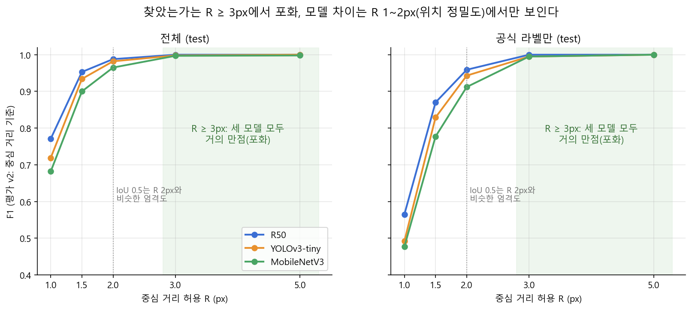

◦ **최종 모델 선정: D-FINE-N** [팀 확정 필요]
- 선정 기준(val 성능으로만, 팀원 모델을 추가하기 전에 정함): ① val mAP50-95(공식 라벨 포함) ② 동률이면 강건성 ③ 속도·크기
- ① val mAP50-95를 val 이미지 복원추출(1,000회)로 비교했다. 전체 val에서 **RT-DETR-l 0.662(0.639~0.690)와 D-FINE-N 0.655(0.633~0.679)가 동률 선두**(차이 −0.008, 95% 구간 −0.016~0.000)이고, YOLO26n 0.642와 R50 0.615는 유의하게 낮다(선두 대비 −0.020, −0.047). 공식 라벨만 보면(59장) R50(0.337)도 동률이 되어, 전체 val의 우위에는 고정 크기 팀 라벨에 박스를 맞추는 정밀도가 섞여 있다.
- ② 동률인 두 모델의 강건성: 합성 점 AP(임계값 무관) D-FINE-N 0.574 대 RT-DETR-l 0.451, 3호기 합성 점(대비 14 이상) 89% 대 61%로 **미탐지 쪽은 D-FINE-N**, 노이즈 보간 가짜 정상 오경보는 RT-DETR-l 37% 대 D-FINE-N 49%로 **오경보 쪽은 RT-DETR-l**이 낫다.
- ③ D-FINE-N은 3.7M 파라미터(가중치 15MB)로 RT-DETR-l(32.8M, 66MB)의 약 1/9이다. 두 모델 모두 촬영 간격(중앙값 4초)보다 훨씬 빠르다.
- **미탐지를 우선했다.** 과제가 "AI 미탐지 조건 분석"이고 결함을 놓치는 비용이 재검사 비용보다 크다고 보았기 때문이다. **이 우선순위는 결과를 본 뒤에 정한 것**이므로 보고서에 그대로 밝힌다. 오경보를 우선하면 RT-DETR-l 또는 R50이 된다.

| 모델 | val mAP50-95 (전체 / 공식만) | 합성 점 AP | 가짜 정상 오경보 (NS+노이즈 6) | 파라미터 |
|---|---|---|---|---|
| **D-FINE-N (선정)** | 0.655 / 0.343 | **0.574** | 49.3% | **3.7M** |
| RT-DETR-l | **0.662 / 0.357** | 0.451 | 36.6% | 32.8M |
| R50 | 0.615 / 0.337 | 0.567 | **0.5%** | 41.4M |
| YOLO26n | 0.642 / 0.314 | 0.501 | 4.1% | 2.5M |

- **약점을 숨기지 않는다**: 노이즈 보간 가짜 정상 오경보 49%, 평균 보간에서도 4.1%. 신뢰도가 0.9 근처에서 포화된다(실제 결함 이미지의 최고 신뢰도 0.75~0.93).
- 목적별 대안: 오경보가 중요하면 R50(GPU, 느림) 또는 YOLO26n(작고 빠르나 3호기 합성 점에 약함), CPU 전용 경량은 YOLOv3-tiny. MobileNetV3는 위치 의존과 노이즈 오경보 때문에 권하지 않는다.

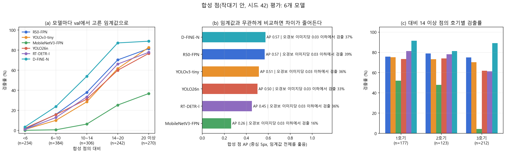

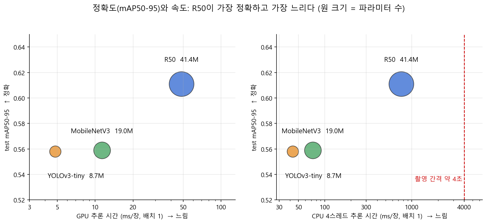

◦ **한계** (숨기지 않고 쓴다)
- 팀원 모델은 학습 조건(입력 크기, epoch, 증강)이 우리와 다르고 임계값을 우리 규칙으로 다시 골랐다. 모델당 학습 시드가 하나이고 mAP50-95 차이의 신뢰구간은 아직 구하지 않았다. 모델마다 학습 조건(증강, AMP, 배치, epoch)이 달라 우열을 단정하지 않는다.
- 강건성 시험(3장)은 test 이미지로 먼저 수행했다. 최종 선정 근거로 쓰려면 val로 반복해야 한다 [val 반복 필요].

---

## 제3장. 영향요인 및 오류분석〔15점〕

◦ **3-1. 오류의 정체: "놓친 것"이 아니라 "박스 크기가 다른 것"**
- IoU 0.5 기준 test 오류는 FN 7 / FP 7(R50, YOLOv3-tiny)인데 **모두 공식 라벨 이미지**다. 확대하면 모델 박스는 점을 정확히 감싸고 있고(중심 거리 0.5~1.2px, YOLOv3-tiny의 1건만 3.0px로 정답 박스가 점에서 치우쳐 있음), 정답 박스가 더 작거나(6x7, 9x5) 더 클 뿐(14x15)이다.
- 중심 5px 기준으로는 R50과 YOLOv3-tiny가 FN 0 / FP 0이다. 우리 세 모델의 오류 이미지가 대부분 같다 → 모델의 약점이 아니라 **라벨 박스 크기와 채점 기준의 문제**다.
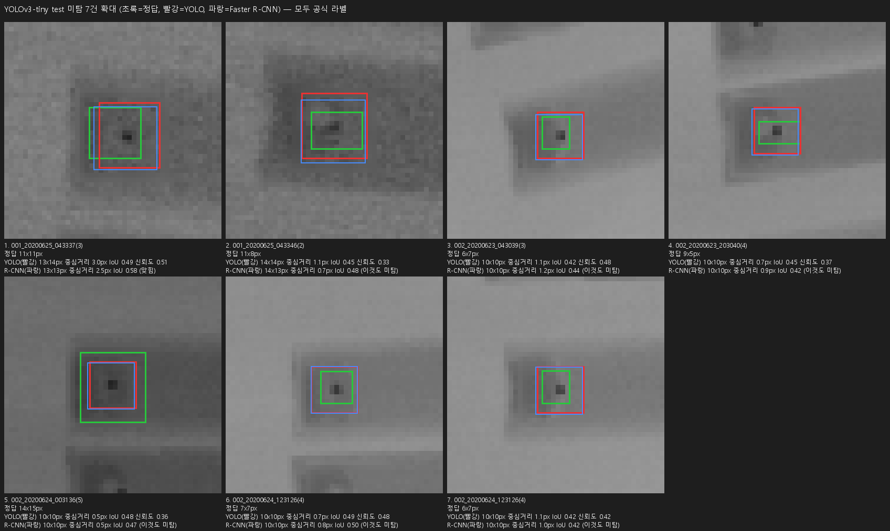
*YOLOv3-tiny가 놓친 것으로 집계된 7건의 확대(초록 = 정답, 빨강 = YOLOv3-tiny, 파랑 = R50). 점은 모두 예측 박스 안에 있다.*

◦ **3-2. 호기·해상도에 따른 차이**
- 뚜렷한 차이는 확인되지 않았다. 가장 낮은 1호기·352x332는 공식 라벨 박스 비율이 76%라 IoU 점수가 낮은 것이다. 공식 라벨 이미지끼리만 비교하면 해상도별 F1이 0.956~0.977로 좁아지고 구간이 겹친다.
- 그룹별 표본이 작다(공식 라벨 이미지는 호기별 20~36장, 해상도 412x332는 정답 2개).
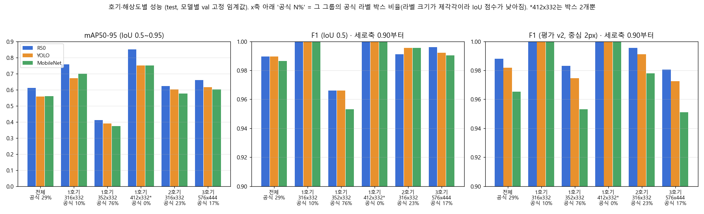

◦ **3-3. 모델은 결함의 점을 보는가: 점 제거 시험**
- 정답의 어두운 점을 보간으로 지운 이미지(Navier-Stokes+노이즈, 평균 보간; 9x9~17x17px)에 같은 모델을 다시 적용했다.
- 점을 충분히 지우면 검출이 거의 사라진다(평균 보간 13x13: R50 663개 중 2개, YOLOv3-tiny 1개) → **위치만 보는 지름길이 아니라 점 자체가 단서**다.
- YOLOv3-tiny에 남는 약한 반응은 보간에 더한 노이즈 무늬 때문이었다(노이즈를 빼면 1개).
- 팀원 모델을 포함한 6개 모델에서도 같다: 노이즈 없는 평균 보간으로 13x13 이상 지우면 남는 검출이 663개 중 0~3개다.
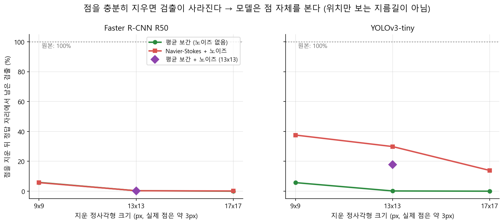
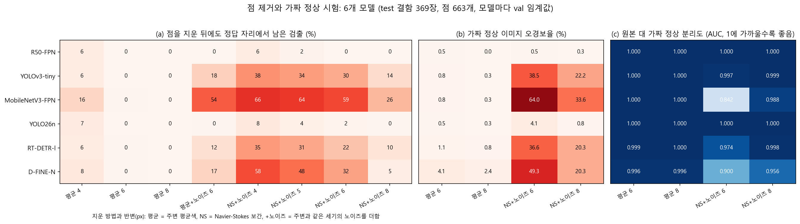
*(a) 점을 지운 뒤 정답 자리에 남은 검출, (b) 가짜 정상 오경보율, (c) 원본 대 가짜 정상 분리도(AUC). 모델마다 val 임계값.*

◦ **3-4. 오경보 조건: 가짜 정상 이미지**
- 정상 이미지가 없어서, 결함 이미지의 점을 지운 이미지를 "가짜 정상"으로 쓰고 이미지 단위 오경보를 쟀다.
- 평균 보간에서는 우리 세 모델 모두 0.8% 이하, **노이즈를 더한 보간에서는 YOLOv3-tiny 22~39%, MobileNet 34~64%, R50은 0.5% 이하**였다. 오경보의 대부분은 점을 지운 자리에서 노이즈 무늬에 반응한 것이다.
- 6개 모델로 넓히면 **R50(0.5%)과 YOLO26n(4.1%)만 반응이 없고**, D-FINE-N 49%, RT-DETR-l 37%도 크게 반응한다(NS+노이즈 6px 기준). 오경보율은 임계값에 좌우되므로 분리도(AUC)도 본다: MobileNet 0.842와 D-FINE-N 0.900이 가장 나쁘고, YOLOv3-tiny는 AUC 0.997인데 낮은 임계값(0.06) 탓에 오경보가 많다. D-FINE-N은 노이즈 없는 평균 보간에서도 오경보가 가장 많다(4.1%).
* 가짜 정상은 진짜 정상 제품이 아니다. 실제 정상 제품의 오경보율은 이 범위 안 어딘가이고 어디인지는 알 수 없다.
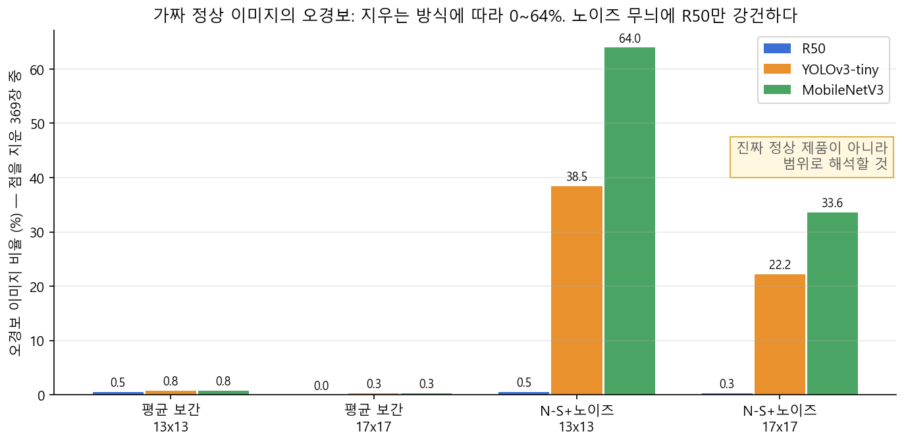

◦ **3-5. 미탐지 조건: 옅은 점, 위치 — 합성 점 시험**
- 실제로는 놓침이 사실상 없어서, 점이 지워진 이미지에 **val의 실제 점**을 진하기 s와 크기 f를 바꿔 넣고 검출률을 쟀다(원래 자리 663개, 무작위 자리 1,107개).
- **옅은 점이 조건이다**: 점의 대비(둘레 밝기에서 점 밝기를 뺀 값)가 약 13 미만이면 R50·YOLOv3-tiny도 많이 놓친다. 실제 test 점은 대비 중앙값 22.8, 하위 10%가 약 17이라 현재 실제 데이터는 안전 영역이다.
- **MobileNet은 위치 의존**: 실제 세기의 점을 무작위 자리에 넣으면 R50 89%, YOLOv3-tiny 90%, MobileNet 30%(3호기는 2%). 원래 자리에서는 97%였다.
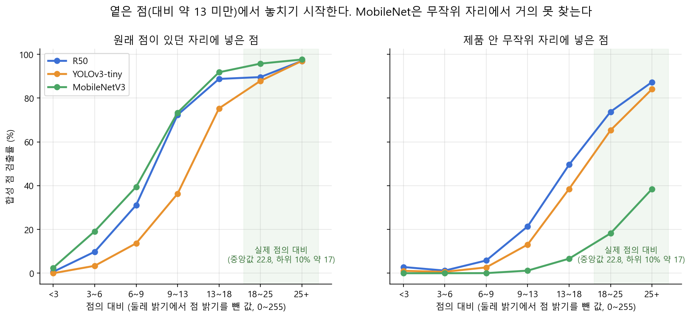
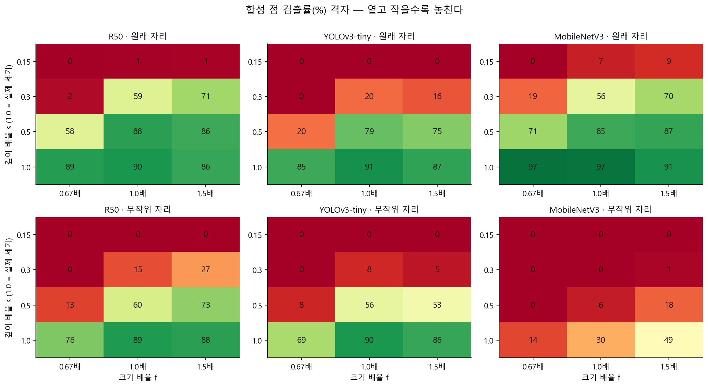
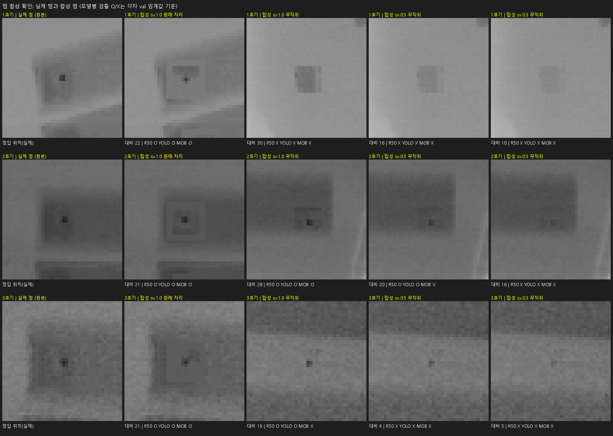

◦ **3-5-2. 합성 점 2차: 작대기 안에만 합성한 공유 평가 데이터 (6개 모델)**
- 1차 합성은 위치가 무작위라 막대 밖에도 점이 놓였다. 2차는 실제 점을 지우고 **영상에서 찾은 작대기(막대) 안쪽에만** 점을 합성하는 생성기(`scripts/synth_eval.py`)를 만들었다. **시드 42로 고정해 팀 모두가 같은 평가 데이터**를 만들고 `--verify`로 확인한다(test 바탕 386장, 점 1,436개; 실제 점 663개가 전부 검출된 막대에 닿는다).
- 대비가 낮을수록 놓친다(대비 6 미만은 모든 모델이 거의 0%). 실제 세기·크기에서 R50은 80~95%, YOLOv3-tiny는 83~97%로, 실제 점(100%)보다 약 10%p 낮다.
- **모델마다 val 임계값으로 보면 D-FINE-N이 가장 많이 찾지만(대비 14~20에서 87%), 이것은 대부분 느슨한 임계값 효과다.** 임계값과 무관한 합성 점 AP로는 D-FINE-N 0.574 ≈ R50 0.567로 같은 수준이고, 오경보를 이미지당 0.03 이하로 맞추면 다섯 모델이 33~39%로 붙는다. **MobileNetV3만 뚜렷이 낮다**(AP 0.262, 16%).
- 3호기(대비 14 이상): MobileNetV3 4%, YOLO26n·RT-DETR-l 약 61%로 1·2호기(73~81%)보다 낮고 R50·YOLOv3-tiny·D-FINE-N은 호기 차이가 작다. 원인은 검증하지 못했다.
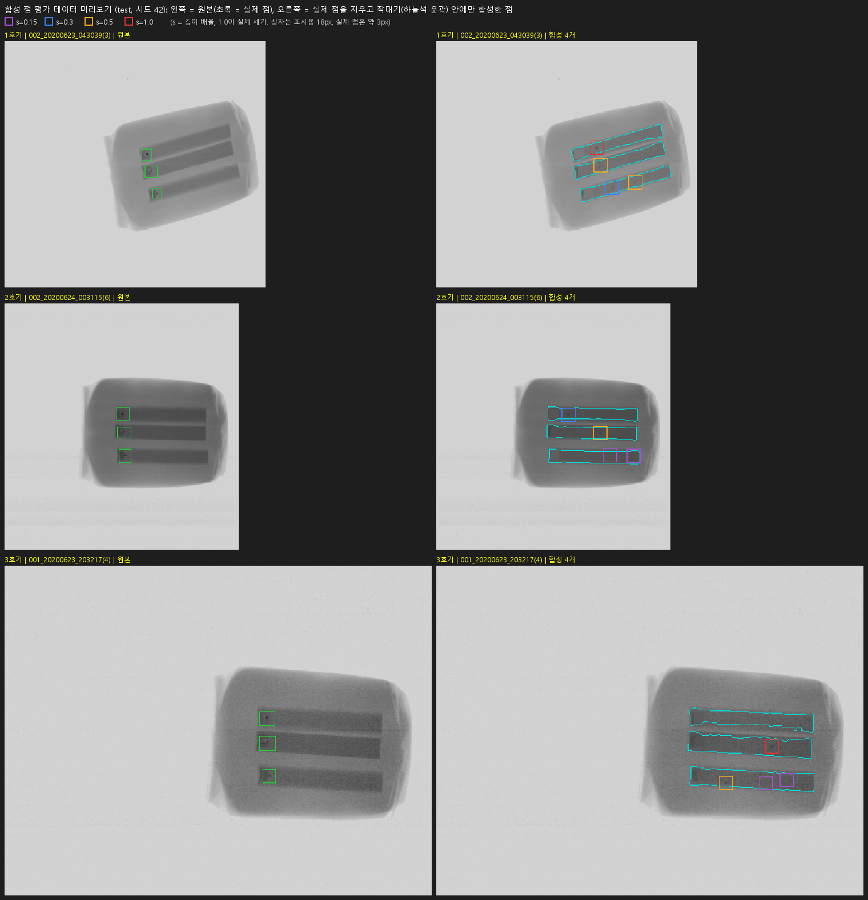
*왼쪽 원본(초록 = 실제 점), 오른쪽 실제 점을 지우고 작대기(하늘색 윤곽) 안에만 합성한 점(색 상자 = 진하기 s). 상자는 표시용이고 실제 점은 약 3px이다.*

*(a) 모델마다 val 임계값, (b) 임계값과 무관한 비교, (c) 호기별.*

◦ **3-6. 이 분석의 한계**
- 합성 점에 사각형 자국이 보이고 합성은 실제보다 약 10%p 덜 현실적이다(실제 점 100%, 합성 s=1.0 R50 약 90%). 그래서 절대 검출률이 아니라 **모델 간 상대 비교**로만 쓴다. "원래 자리 > 무작위 자리" 차이는 자리 효과와 자국 효과가 섞여 있다.
- 시드 하나, test 이미지 사용, 표시 제거 흔적은 미검증이다. 2차 합성의 막대 검출은 실제 점이 막대에 닿는지로만 검증했고 사람이 그린 정답은 없다. s=0.15·0.3 칸의 점은 대부분 대비 10 미만이라 실제 결함 범위 밖일 수 있다. 오경보 예산별 검출률의 임계값은 합성 이미지 자체로 골랐다(비교 분석용).

---

## 제4장. 현장 활용방안〔10점〕

◦ **처리 시간과 장비**
- 같은 촬영 묶음의 연속 촬영 간격은 호기와 관계없이 **중앙값 4초**(5% 분위 3초)다. 모든 모델이 처리량 면에서 충분하다.
| 모델 | GPU (ms/장) | CPU 1스레드 | CPU 4스레드 | CPU 16스레드 |
|---|---|---|---|---|
| YOLOv3-tiny | 4.8 | 142 | 43 | 35 |
| Faster R-CNN MobileNetV3 | 11.3 | 149 | 73 | 73 |
| Faster R-CNN R50 | 48.4 | 2,073 | 756 | 584 |
| D-FINE-N (최종) | 26~92 | 174~915 | - | 114~473(4스레드) |
| YOLO26n | 14~46 | 94~405 | - | 139~400(4스레드) |
| RT-DETR-l | 33~92 | 497~578 | - | 496~505(4스레드) |
* 아래 3개 모델(팀원 모델)은 두 번 측정한 범위이며 실행마다 크게 변동했고(원인 미확인) 라이브러리의 전처리 시간이 포함되어 위 행들과 직접 비교하지 않는다. 배치 1, fp32, RTX 4050 Laptop / Intel Core i7-13620H. CPU 값은 실행마다 20~40% 변동한다. **현장 장비의 사양은 알지 못한다** [확인 필요].
- 최종 모델 D-FINE-N은 CPU 4스레드에서도 0.1~0.5초라 촬영 간격 안에 충분하다. 더 빠른 경량이 필요하면 YOLOv3-tiny(CPU 4스레드 43ms)가 대안이다.

◦ **재검사 기준 제안 (3단 판정, D-FINE-N 기준)**
- 불합격: 한 장의 최고 신뢰도 ≥ 0.66(val에서 정한 임계값). 재검사: 0.3 ≤ 최고 신뢰도 < 0.66. 합격: < 0.3.
- test 실제 이미지의 분포: 결함 369장은 최고 신뢰도가 전부 0.748 이상(불합격), 빈 라벨 27장은 전부 0.04 이하(합격). **실제 데이터에는 애매한 이미지가 없었다.**
- 재검사 구간은 **옅은 결함 대비책**이다. 하한을 0.66에서 0.3으로 낮추면 옅은 합성 점(대비 9~18)의 검출률이 61.9% → 67.1%로 오르고, 가짜 정상 오경보는 4.1% → 5.7%(평균 보간), 49.3% → 58.8%(노이즈 보간)로 는다. 노이즈 보간 가짜 정상은 0.9 미만에서 오경보가 크게 남아, **오경보가 비싼 현장에서는 재검사 구간의 이득이 작다.**
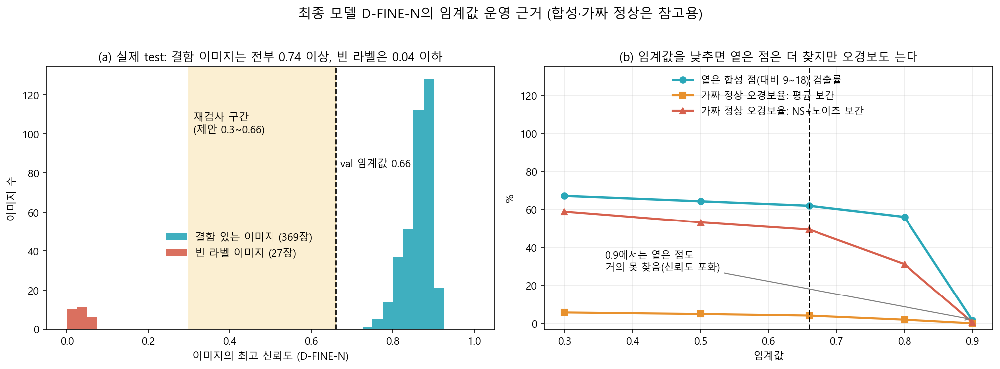
* 합성·가짜 정상에 기반한 참고용 수치다. 재검사 1건의 비용과 놓침 비용은 현장 값을 몰라 가정하지 않았다 [확정 필요].

◦ **모델 선택 가이드**
| 상황 | 권장 | 이유 |
|---|---|---|
| **기본(최종 모델)** | D-FINE-N | val 동률 선두, 미탐지 강건성 최상(합성 점 AP 0.574), 3.7M으로 작음. 노이즈 오경보 49% |
| 오경보가 중요한 현장 | Faster R-CNN R50 또는 YOLO26n | 노이즈 오경보 0.5%·4.1%. R50은 느림, YOLO26n은 3호기 합성 점에 약함 |
| CPU 전용 / 최경량 | YOLOv3-tiny | CPU 4스레드 43ms, 정확도 손실이 작음 |
| (비권장) | MobileNetV3 | 위치 의존(무작위 자리 30%), 합성 점 AP 0.262, 노이즈 오경보 34~64% |

◦ **운영 시 주의** [제안, 미구현]
- 임계값은 val로 정해 고정하고, 호기별 최고 신뢰도 분포와 오경보 건수를 주기적으로 확인한다. 옅은 결함 쪽 성능은 시험편(합성 점)으로 점검할 수 있다.

---

## 제5장. 창의성 및 차별성〔10점〕

◦ **기여는 새 알고리즘이 아니라 "점수를 믿을 수 있게 만드는 검증 방법"이다**
- ① **평가 재설계**: 공식·팀 라벨 분리, 중심 거리 평가, mAP50-95 → 포화된 점수(F1 0.99) 뒤의 차이를 드러냄 (2장)
- ② **점 제거 시험**: 결함을 지워 모델이 점 자체를 보는지 확인 → 지름길 우려를 해소 (3-3)
- ③ **가짜 정상과 합성 점**: 정상 이미지가 없는 데이터에서 오경보와 미탐지 조건(옅은 점, 위치)을 정량화 (3-4, 3-5)
- ④ **임계값과 무관한 비교와 공유 평가 데이터**: 모델마다 임계값이 달라 검출률이 왜곡되는 것을 AP·오경보 예산으로 바로잡고(3-5-2), 시드 42로 같은 합성 평가 데이터를 팀 모두가 만들어 검증하게 했다
- ⑤ **분석을 조치로**: 모델별 취약점이 모델 선택 가이드와 재검사 구간으로 이어짐 (4장)
- 이 검증이 없었다면 "여섯 모델은 F1 0.99로 동일하다"에서 끝났을 것이다. 검증으로 R50·YOLO26n과 나머지의 노이즈 오경보 차이, MobileNet의 위치 의존, 옅은 점이라는 약점, D-FINE의 합성 점 우위가 임계값 효과라는 사실이 드러났다.

---

## 제6장. 코드 구성 및 재현성〔10점〕

◦ **환경**: conda `KAMP`(Python 3.10), torch 2.6.0+cu124, torchvision 0.21.0, numpy 2.2. 한글 경로 때문에 실행 시 `PYTHONUTF8=1` 필요. `requirements.txt`.

◦ **코드 구성**
- `src/yolov3/`: 베이스라인 YOLOv3(호환 수정본)
- `src/minyeop/`: `faster_rcnn/`(학습·예측·평가·시각화), `faster_rcnn_mobilenet/`, `yolov3_tiny/`, 분석(`dot_removal/`, `fake_normal/`, `synth_insert/`, `synth_eval/`, `group_stats/`, `extra_models/`: 팀원 모델 가중치로 6개 모델 비교)
- `scripts/synth_eval.py`: 시드 42 합성 평가 데이터 생성기, `scripts/synth_eval_reference/`: 기준본(점 위치·해시)
- `docs/`: 평가 지표, 실험 결과 표, 분석 해석, 결과 기록 규칙
- `ppt/`: 이 보고서의 초안과 그림 생성 스크립트

◦ **실행 순서(현재)**: 학습 → val 예측 → test 예측(한 번) → 보고 표 → 분석. 명령은 `src/minyeop/README.md`에 있다.
* **전처리부터 결과 생성까지 한 번에 도는 스크립트는 아직 없다** [작성 필요]. **전처리 코드와 테스트 예측 결과 CSV도 아직 없다** [작성 필요].

◦ **재현성 주의**: 합성 평가 데이터는 시드 42와 이미지 이름별 시드로 만들고 기준본과 비교해 같은 데이터인지 확인한다(`python scripts/synth_eval.py --verify`; 다른 PC에서 위치·조건이 같고 픽셀 해시가 다르면 라이브러리 버전 차이). 모델 학습은 시드를 고정했으나 GPU 연산 순서에 따라 소수점 끝자리가 달라질 수 있다. 데이터는 `manifest.csv`의 sha256으로 버전을 확인한다.

---

## 경진대회 만족도 조사 완료 페이지 캡쳐 화면(필수)
- 만족도 조사 url: https://naver.me/FetWt7SN
- [작성 필요] 설문 제출 후 완료 화면을 캡처해 첨부(계정 정보가 드러나지 않게 자를 것). 양식에 있는 예시 이미지는 우리 것이 아니다.
